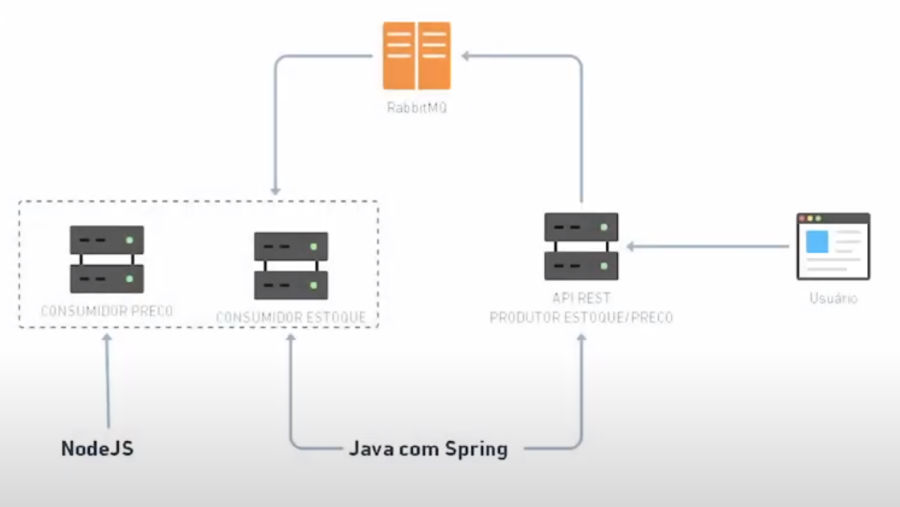

# Curso_RabbitMQ

Projeto para estudar sobre RabbitMQ, consiste em um microsserviço que será o produtor da mensagem e dois consumidores.

## Estrutura do Projeto

## Link do curso

[Curso de RabbitMQ com Java Spring Boot](https://www.youtube.com/watch?v=BwQMTRh1hCc&list=PL1OeYyl9zqzHDN67rto7KMtezTLmk1N-K)
